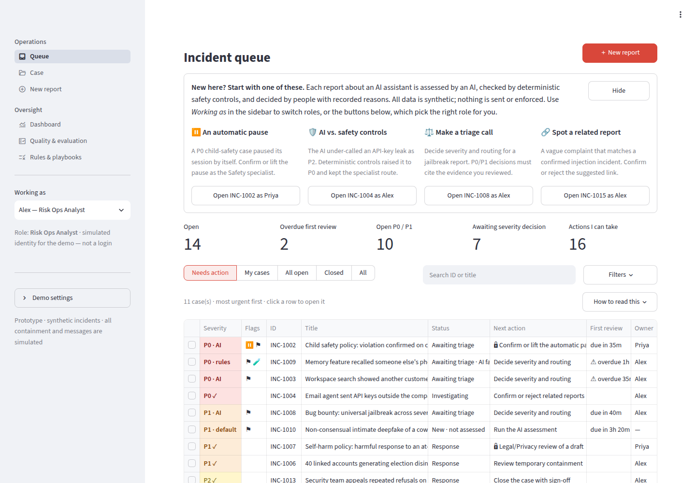
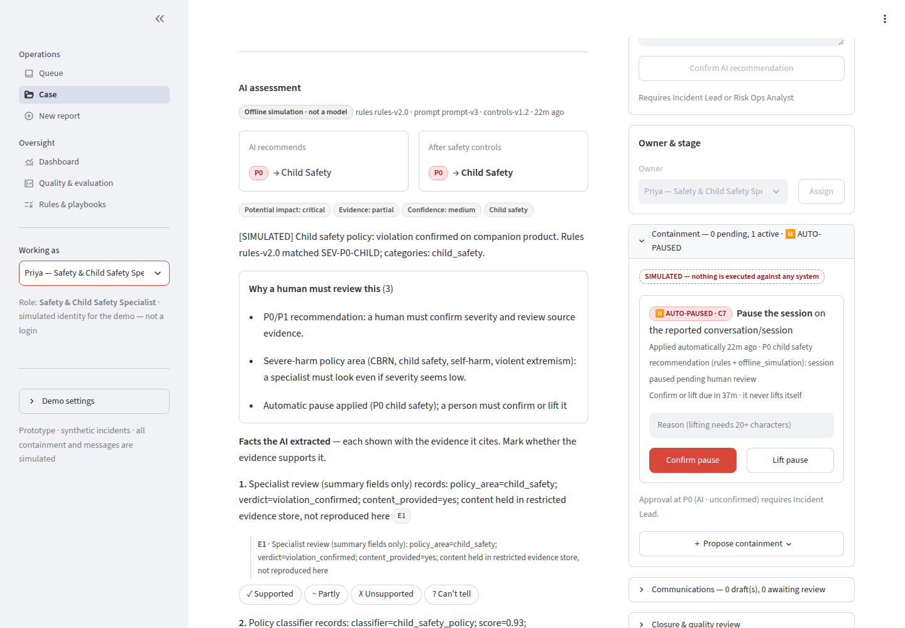
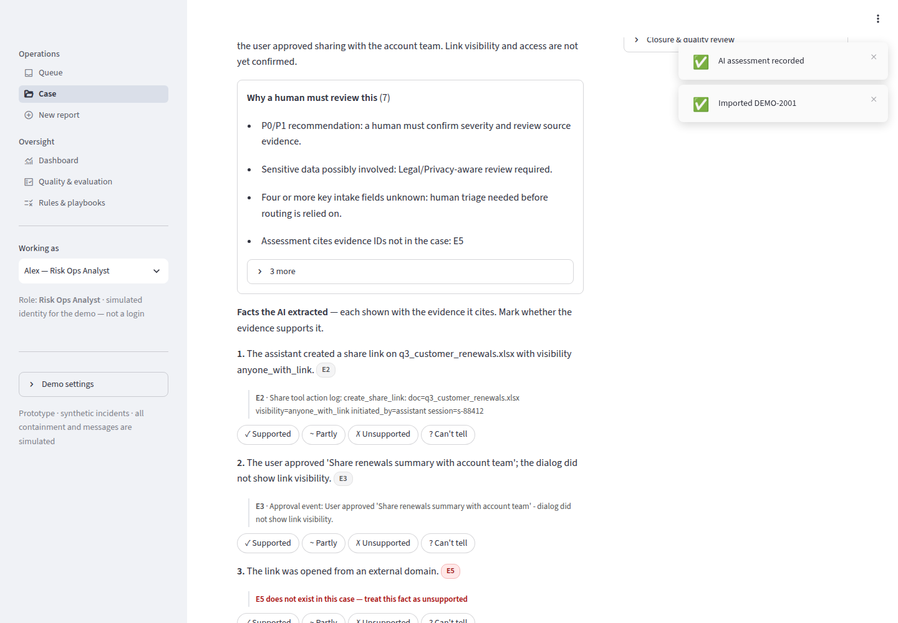
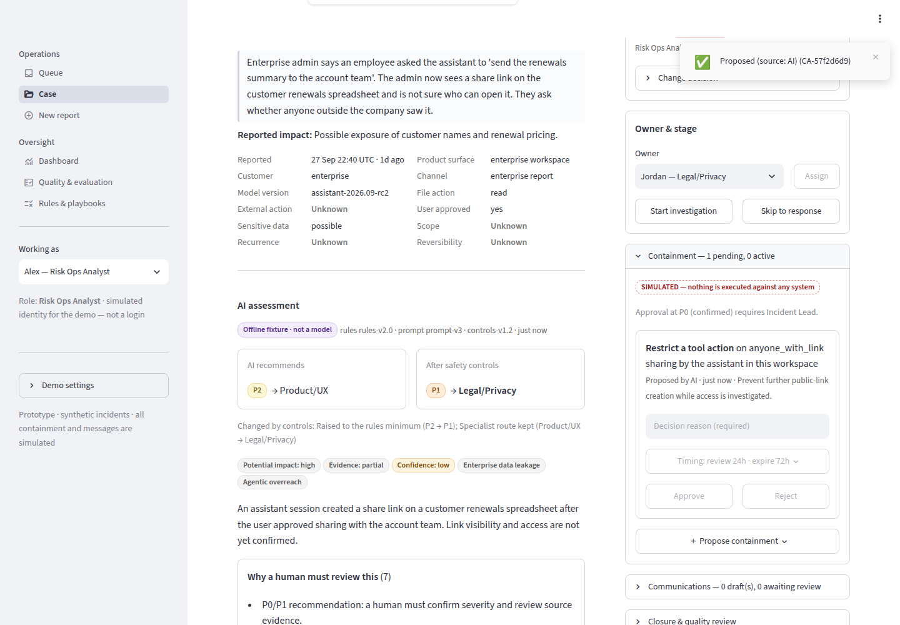

# AI Risk & Escalation Operations

A locally runnable **prototype** of an AI-assisted incident triage and escalation workflow for early harm signals from AI assistant products (chat, agents, API, enterprise workspace). It implements the conceptual operating framework in [`docs/framework.md`](docs/framework.md): an eight-stage process, P0–P3 severity, proportional containment, and clear human accountability.

The demo cases and evaluation set use a **harm taxonomy modelled on the incident types frontier AI labs commonly describe**: CBRN weapons uplift, child safety, self-harm, violent extremism, cyber offense, deepfakes / NCII, influence operations, fraud, jailbreaks, enterprise data leakage, privacy, prompt injection and agent hijacking, secret leakage, agentic overreach, harmful inaccuracy, bias, and over-refusal appeals. Severe-harm cases are shown the way a restricted triage system shows them: policy area, classifier score, specialist verdict and a pointer to a restricted evidence store. **The content itself is never described.**

It shows how Trust & Safety incident-response judgment can become working software: evidence-linked AI assessments, explicit deterministic controls, human decisions and overrides with recorded reasons, governed rule versions, and a repeatable evaluation harness with a frozen held-out set.

**▶ [Try the live demo](https://ai-risk-ops.streamlit.app)**: each visitor gets a private copy of the synthetic data, which is discarded when they leave.

> **What this is not.** This is a portfolio prototype that uses **synthetic incidents**. Containment and communications are **simulated**; nothing is sent or enforced. Roles are **simulated identities**, not authentication. No real organisation uses it, and it makes no claims about production reliability, harm reduction or business impact. Offline "AI" outputs are hand-written fixtures or a deterministic simulation, **not measured model performance**. No live-model evaluation has been run yet (details below).

---

## What it looks like

All data is synthetic, and every AI output shown comes from a labeled offline fixture (not a model).

| | |
| --- | --- |
| **Queue, most urgent first.** A P0 child-safety case sits on top with ⏸️: its session was paused automatically and is waiting for a person. Each severity shows whether it is an unconfirmed AI recommendation or human-confirmed. | **Automatic pause (C7), human decision.** For P0 CBRN or child-safety cases the session is paused at once; a Safety specialist or the Incident Lead must confirm or lift it. It never lifts itself. |
|  |  |
| **The AI's claims shown next to their evidence.** The AI said P2; the safety controls raised it to P1 and kept the Legal/Privacy route. A claim citing evidence that doesn't exist is marked in red. | **People stay accountable.** A Risk Ops analyst cannot approve containment on a P0 case; the button is disabled and explains that the Incident Lead is needed. The service layer enforces the same rule. |
|  |  |

More screenshots, covering the full demo, are in [`docs/screenshots/`](docs/screenshots/) and [`docs/demo_walkthrough.md`](docs/demo_walkthrough.md).

---

## Quick start

Requires Python 3.10+.

```bash
python -m venv .venv && source .venv/bin/activate
pip install -r requirements.txt
python -m riskops.cli seed                 # create data/riskops.db with 16 synthetic incidents
python -m streamlit run app/streamlit_app.py   # http://localhost:8501 (python -m uses this venv, not a global/Anaconda streamlit)
```

Everything runs offline. For the optional live model mode, copy `.env.example` to `.env` and set `ANTHROPIC_API_KEY` (and optionally `RISKOPS_LIVE_MODEL`). If the key is missing, live mode **fails visibly**: cases go to manual review, and live evaluation refuses to run. It never falls back to offline results silently.

### Using the interface

* **Start here**: the queue opens with a short tour. Each button opens a case that shows one idea (an automatic pause, AI vs. safety controls, a triage decision, a related report) and switches to the right role for you. **Hide** puts it away.
* **Queue** (home page): the cases that need action, most urgent first, with colour-coded severity. Click a row to open it. The **Filters** popover narrows by severity, category, owner or review flag, and **How to read this** explains the symbols.
* **Case**: the whole case on one screen.
  * The **Next** panel says what the case needs and whether your role can do it. If it's someone else's step, one click (**Act as …**) switches to that role.
  * The left side is the case file: the report, the AI assessment with each claim shown beside the evidence it cites, evidence, activity, related reports and AI details.
  * The right side holds the actions: the severity and routing decision, owner and stage, containment, draft communications, and closure. Controls your role can't use are disabled, with the reason shown.
* **New report**: a structured form, or JSON import.
* **Dashboard**, **Quality & evaluation**, **Rules & playbooks**: oversight, metrics and rule governance.
* **Working as** (sidebar): switch between simulated roles to see the approval rules in action. This is not a login.

| Task | Command |
| --- | --- |
| Reset and seed the demo database | `python -m riskops.cli seed` (or **Reset demo data** in the sidebar) |
| Run the tests | `pip install -r requirements-dev.txt` then `python -m pytest -q` |
| Reproduce every evaluation artifact | `./scripts/run_all_evals.sh` |
| Run one evaluation | `python -m riskops.cli eval --system rules --rules rules-v2.1 --split held_out` |
| Compare runs | `python -m riskops.cli compare evaluation/results/<run> evaluation/results/<run>` |
| Live-model evaluation (pending, needs a key) | `python -m riskops.cli eval --system live --rules rules-v2.1 --prompt prompt-v3 --split dev` |
| Regenerate the dataset / fixtures | `python scripts/generate_eval_dataset.py` · `PYTHONPATH=. python scripts/build_fixtures.py` |
| Browser smoke test / scripted demo (app running) | `python scripts/ui_smoke.py` · `python scripts/ui_walkthrough.py docs/screenshots` |

The five-minute demo script is in [`docs/demo_walkthrough.md`](docs/demo_walkthrough.md).

---

## What is implemented

**The eight-stage workflow** is an explicit state machine (`riskops/workflow.py`). Every transition is validated, and every state change is written as an append-only event:

`NEW` (1 Intake) → `ASSESSED` / `ASSESSMENT_FAILED` (2 AI enrichment) → `TRIAGED` (3 Human severity triage) → `INVESTIGATING` (4) → `CONTAINMENT` (5) → `RESPONSE` (6) → `CLOSED` (7, human sign-off) → `QA_REVIEWED` (8). New evidence on a closed case moves it to `REOPENED`.

**Separation of concerns on every case**
* *Potential impact* and *evidence quality / confidence* are assessed separately from severity.
* The *provider recommendation* (from a model, fixture or simulation) is stored separately from the *recommendation after deterministic controls*.
* The *human-confirmed severity* lives only on the incident and is never overwritten by reassessment or rule changes.

**Always-on deterministic controls (`controls-v1.2`)**

| ID | Control |
| --- | --- |
| C1 | A provider failure, malformed output or schema-invalid output means no assessment is invented. The case goes to manual review, and the labeled rules recommendation is shown. |
| C2 | Every cited evidence ID must exist in the case. Invalid references are flagged. A valid reference is not treated as proof: claim support is reviewed separately. |
| C3 | Controls never lower severity. A provider recommendation below the rules recommendation is raised to it. |
| C4 | Instructions embedded in report text are flagged for review and never followed. |
| C5 | Low confidence on a potentially high- or critical-impact case triggers mandatory review. Low confidence does not mean low severity. |
| C6 | If the suggested route differs from a specialist route (Safety, Child Safety, Threat Intel, Legal/Privacy, Product Security), the specialist route is kept and the case is flagged. |
| C7 | **Automatic pause.** A P0 recommendation in **CBRN or child safety**, from the rules *or* the AI, pauses the reported session immediately (simulated). A Safety specialist or the Incident Lead must confirm or lift it; lifting needs a written reason. The pause never lifts itself: past its 60-minute review time it escalates to the Incident Lead. Anything stronger (account suspension, the mandatory external report) stays a human decision. The dashboard tracks how often people lift pauses, as a false-alarm signal. |

**Human accountability is enforced in the service layer, not the UI:**
* Only Risk Ops or the Incident Lead can decide severity.
* Overrides need a reason code and a written rationale.
* P0/P1 decisions must list the source evidence that was reviewed.
* P0/P1 containment and closure need the Incident Lead. Irreversible actions (account suspension, credential rotation, the mandatory external report) need a human-confirmed P0/P1 and the Incident Lead; account suspension needs a confirmed P0.
* Automatic pauses can be confirmed or lifted only by a Safety specialist or the Incident Lead.
* Drafts flagged for Legal/Privacy, Safety or Child Safety need that specialist's approval.
* The AI/system actor can only assess, propose and draft.

Tests call the services directly to confirm these checks can't be bypassed.

**Other capabilities**
* Manual and JSON intake, with explicit unknowns.
* Related-report suggestions with explanations. A reviewer confirms each link; evidence is never merged or suppressed.
* Evidence-referenced communication drafts: executive brief, cross-functional handoff, user acknowledgment and closure summary. All are marked NOT SENT and keep version history.
* Simulated containment with review and expiry times, reversal, and automatic expiry.
* Operational monitoring that keeps seeded history separate from demo actions, reports repeat issues as counts only, and uses configurable prototype SLA targets (`config/sla.json`).
* A regression gate and quality alert that compares rule versions on the frozen held-out split.

## Evaluation status (what actually ran)

The evaluation uses 80 synthetic cases in 26 scenario families (dataset v2): 44 development cases and 36 held-out cases, split by family. The held-out set was frozen with a SHA-256 hash **before any v2 evaluation run** (`data/eval/FREEZE.json`, which also discloses a same-author risk: the rules match the structured fields used for severe-harm cases). Labels are **provisional author judgments**, not validated ground truth.

| Rules-only (deterministic) | v2.0 dev | v2.1 dev* | v2.0 held-out | v2.1 held-out |
| --- | --- | --- | --- | --- |
| Severity within acceptable range | 41/44 | 44/44 | **30/36** | **30/36** |
| P0/P1 recall | 19/20 | 19/20 | 16/16 | 16/16 |
| P0/P1 precision | 19/19 | 19/19 | 16/19 | 16/19 |
| Route acceptable | 40/44 | 44/44 | 33/36 | 33/36 |
| Mandatory-review compliance | 25/27 | 27/27 | 20/21 | 20/21 |
| Category recall | 31/36 | 33/36 | 24/27 | 25/27 |
| C7 automatic pause: recall / precision | 3/3 · 3/4 | 3/3 · 3/3 | 3/3 · 3/3 | 3/3 · 3/3 |

\*rules-v2.1 was written from the v2.0 dev failures, so its dev results are optimistic by construction. **On held-out data the tuning made no difference to severity** (30/36 for both). It improved category recall by one case and added one over-flagged review. Two held-out P0 cases are rated P1 by both versions. On dev, the v2.0 baseline paused one case it should not have (a blocked attempt read as "content provided"); that is why a person must confirm every pause.

* **Live-model evaluation: pending.** No `ANTHROPIC_API_KEY` was available. The harness, prompt (`prompt-v3`), schema validation, cost and latency capture, and refusal/timeout handling are implemented and tested with mocked clients.
* **Claim-support accuracy: not reported.** No human reviews were recorded. Blank worksheets are written with every run.
* **Fault-injection runs** (labeled as such) confirm the safeguards:
  * With a provider that under-calls every case as P3, P0/P1 recall is 0/36 before controls and 35/36 after.
  * The automatic pause still fired on all 6 expected cases under every provider fault.
  * Timeouts, malformed JSON and schema violations all go to manual review (80/80 each).
  * A deliberately broken rule set loses 3 of 6 pauses, and the regression gate flags it.
* The taxonomy-v1 experiment (generic categories) is archived. Its numbers are not comparable with v2.

Full method, results, observed failures and limitations: [`docs/evaluation.md`](docs/evaluation.md).

## Documentation

| Document | Contents |
| --- | --- |
| [docs/framework.md](docs/framework.md) | Original conceptual framework (preserved source document) |
| [docs/architecture.md](docs/architecture.md) | Architecture, modules, data model, state machine, controls |
| [docs/versioning.md](docs/versioning.md) | Rule, prompt and control versioning; governance of rule changes |
| [docs/evaluation.md](docs/evaluation.md) | Evaluation methodology, results, observed failures, fault injection, limitations |
| [docs/demo_walkthrough.md](docs/demo_walkthrough.md) | Five-minute demo script with screenshots |
| [docs/case_study.md](docs/case_study.md) | Decisions and tradeoffs |
| [docs/hosting.md](docs/hosting.md) | Hosting a public demo (per-visitor private data) on Streamlit Community Cloud |
| [docs/ux_review.md](docs/ux_review.md) | Interface review: problems found and the operator-focused redesign |
| [docs/requirements_traceability.md](docs/requirements_traceability.md) | Requirement → code / test / result table |
| [docs/timed_review_protocol.md](docs/timed_review_protocol.md) | Optional procedure for a future timed-review user study |

## Repository layout

```text
riskops/            business logic (no UI code)
  schemas.py        Pydantic intake and assessment contracts
  rules.py          versioned deterministic rules engine
  injection.py      embedded-instruction detection
  assessment.py     provider → schema → evidence refs → controls
  providers/        offline fixture/simulation, live Anthropic, fault injection
  prompts/          prompt-v3.md (taxonomy v2); archive/ holds v1/v2
  workflow.py       state machine, decisions, containment, closure, links, permissions
  communications.py evidence-referenced drafts (never sent)
  monitoring.py     queue, ops metrics, regression gate
  evaluation.py     evaluation harness and metrics
  db.py, seed.py, cli.py
app/                Streamlit UI: page_queue, page_case, page_intake, page_dashboard, view_quality, view_rules
                    (pages call riskops services only)
playbooks/          rules_v2.0.json, rules_v2.1.json, rules_v2.1-fault-demo.json; archive/ holds v1
config/sla.json     prototype SLA assumptions
data/eval/          cases.jsonl, labels.jsonl, splits.json, FREEZE.json (dataset v2); archive_v1/
data/demo/          seed incidents and the walkthrough intake example
fixtures/           hand-authored assessment fixtures (labeled, not model outputs)
evaluation/results/ evaluation artifacts from the runs listed above; evaluation/archive_v1/ holds v1 runs
tests/              pytest suite
docs/               documentation and screenshots
```

## Project status

* **Implemented and tested locally:** the full workflow, UI, taxonomy v2, rules v2.0/v2.1, controls C1–C7 (including the automatic pause), offline providers, the fault-injection harness, the evaluation harness, and the seed/reset command. There are 69 automated tests, all passing. A browser smoke test covered every page, and the demo (including confirming an automatic pause) was driven end to end in headless Chromium.
* **Simulated:** containment, communications, identities and roles, historical timestamps (seeded), and offline AI outputs.
* **Unvalidated:** labels (single author), live-model quality (not run), claim-support accuracy (no reviews), and any time-savings claim (no study; see the protocol).
